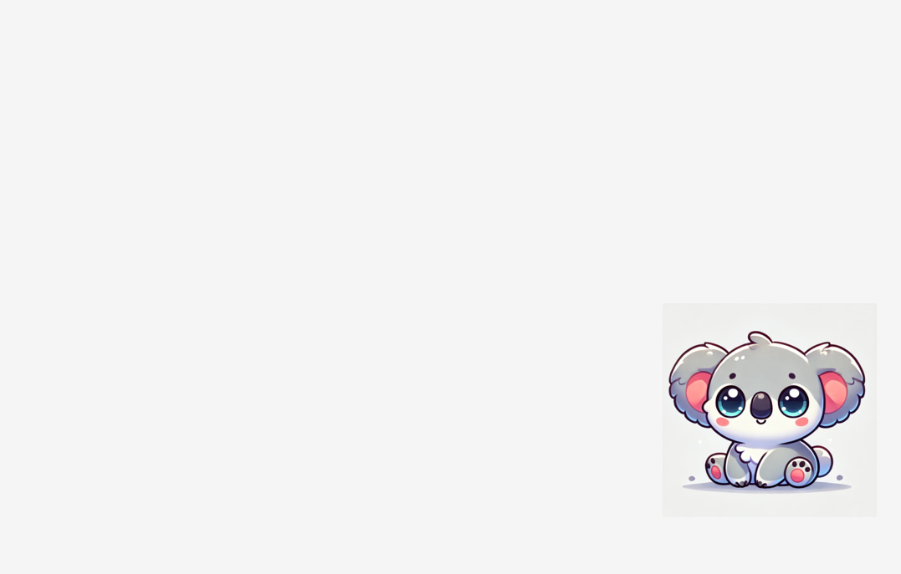

# Liam's Game

"Video Game" built for my son while he was a baby. I sit him on my lap,
he smashes keys and random images popup on the screen.

Initially I built it with Odin but I didn't have much time, so I rewrote in
golang.




## Building

You will need go lang to run it.

```bash
$ git clone https://github.com/wilbertom/LiamsGame
$ cd LiamsGame
$ go run main.go
```

Press `ESC` to exit.
